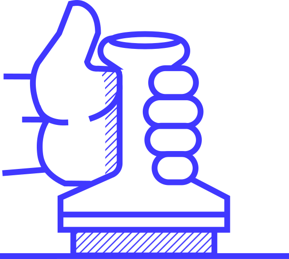
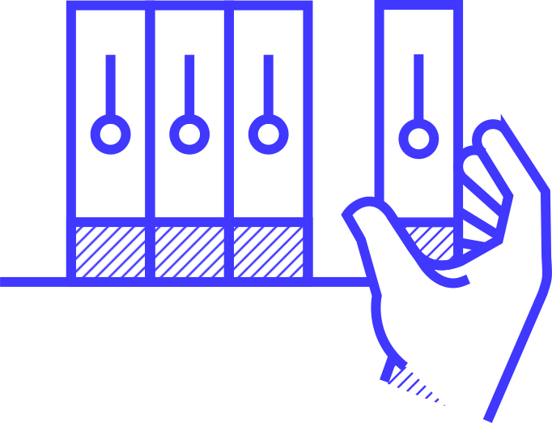
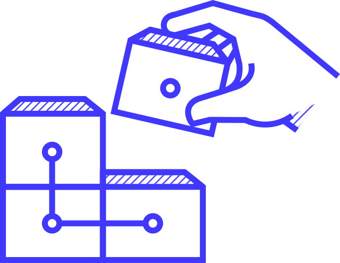

<p align="center"></p>

<div align="center">
  <h3> Руководство по работе с нашим <a href="https://testnet.joystream.org/"> текущим тестнетом</a> с которым Вы можете ознакомиться используя указанные ниже ссылки<h3>
</div>

<div align="center">
  <h4>
    <a href="/roles/validators">
      Валидаторы
    </a>
    <span> | </span>
    <a href="/roles/council-members">
      Члены Совета
    </a>
    <span> | </span>
    <a href="/roles/storage-providers">
      Поставщики Хранилищ
    </a>
    <span> | </span>
    <a href="/roles/content-curators">
     Кураторы Контента
    </a>
    <span> | </span>
    <a href="/roles/builders">
      Сборщики
    </a>
  </h4>
</div>
<div align="center">
  <h5>
    <a href="/tools/cli">
      CLI
    </a>
    <span> | </span>
    <a href="/roles/content-creators">
      Создатели Контента
    </a>
  </h5>
</div>
</br>

Оглавление
---

<!-- TOC START min:1 max:3 link:true asterisk:false update:true -->
- [Обзор](#Обзор)
  - [Вклад](#Содействие)
  - [Получение денег за участие](#получение-денег-за-участие)
- [Начало](#Начало)
  - [Генерация ключей](#генерация-ключей)
  - [Получение членства](#получение-членства)
- [Поощрения](#поощрения)
- [Программа для членов-учредителей](#программа-для-учредителей)
- [Активные роли](#активные-роли)
  - [Валидаторы](#валидаторы)
    - [Описание](#описание)
    - [Стимулы](#стимулы-1)
  - [Члены Совета](#члены-совета)
    - [Описание](#описание-1)
    - [Стимулы](#стимулы-2)
  - [Поставщики Хранилищ](#поставщики-хранилищ)
    - [Описание](#описание-2)
    - [Стимулы](#стимулы-3)
  - [Кураторы Контента](#кураторы-контента)
    - [Описание](#описание-3)
    - [Стимулы](#стимулы-4)
  - [Сборщики](#сборщики)
    - [Описание](#описание-4)
    - [Стимулы](#стимулы-5)
- [Другие Функции и Инструменты](#другие-функции-и-иструменты)
  - [Создатели контента](#создатели-контента)
    - [Описание](#описание-5)
  - [CLI](#cli)
  - [Сетевой Форум](#сетевой-форум)
<!-- TOC END -->

# Обзор
Данный репозиторий содержит детальное руководство для поддержки пользователей по взаимодейтсвию с нашим текущим [тестнетом](https://testnet.joystream.org/).

## Содействие
Если Вы обнаружите, что что-то не так или отсутствует в этих руководствах, пожалуйста создайте отчет о [проблеме](https://github.com/Joystream/helpdesk/issues), или лучше всего, сделайте ветку для проблемного репозитория и создайте [PR](https://github.com/Joystream/helpdesk/pulls) чтобы помочь нам стать лучше!

## Получение Денег за Участие
Токен тестовой сети Joystream (tJOY) поддерживается фиатным пулом, номинированным в долларах США, и в настоящее время погашается через Bitcoin Cash. Более подробную информацию о том как это работает Вы можете найти ниже. Если Вы хотите найти текущий курс обмена когда фиатный пул пополняется и отслеживать статус незавершенных обменов, перейдите [сюда](https://www.joystream.org/testnet).

Для обмена Ваших монет, следуйте этим шагам.
1. Чтобы мы знали, адрес для оплаты, Вы должны связать свой адрес Joystream с адресом Bitcoin Cash. Самый простой способ сделать это открыть на боковой панели вкладку `My Memo` в разделе `My Keys`. Убедитесь, что в раскрывающемся списке, в правом верхнем углу интерфейса Pioneer выбрана правильная учетная запись (именно та учётная запись которая содержит токены, которые Вы хотите обменять)

```
# Ниже в заметке размещена только часть строки:
1OR3ORqORzYOURBBITCOINCASHADDRESS
```

2. Отправьте Вашие тестовые монеты (tJOY) на следующий адрес:

```
5D5PhZQNJzcJXVBxwJxZcsutjKPqUPydrvpu6HeiBfMaeKQu
```

Как только монеты будут зачислены на этот адрес, сразу после этого, время, дата, Ваш адрес, Ваши заметки и текущий курс обмена tJOY/USD будут записаны в журнал. Затем Ваши токены сжигаются (уменьшая выпуск tJOY), и сумма в долларах вычитается из фиатного пула. Это означает, что на обменный курс это не повлияет. Ваш Bitcoin Cash должен быть доставлен в течение 72 часов, поскольку мы выполняем групировку транзакции. Также обратите внимание, что учитывается обменный курс BCH/USD на момент перевода Bitcoin Cash.

# Начнём
Чтобы начать работу и участвовать в тестовых сетях Joystream, вы должны сначала сгенерировать `Ключи`, и зарегистрироваться для получения `Членства`. Для этого не требуется никакого программного обеспечения или загрузка, так что Вы можете сделать это в вашем браузере в Pioneer [здесь](https://testnet.joystream.org).

## Генерация ключей
Нажмите `Mои Ключи` на боковой панели, затем нажмите кнопку `Добавить аккаунт`. Выбор, который Вы сделаете здесь, в определенной степени зависит от того, что Вы собираетесь делать. Если Вы просто хотите "поиграться", Вы можете следовать рекомендуемым настройкам по умолчанию. Если у Вас есть конкретная роль, тогда Вы можете перейти по ссылке на инструкции в [заголовок документа](#заголовок-документа), или ознакомиться с ними более детальней [здесь](#активные-роли).

В любом случае `Ключи` будут автоматически сохраняться в хранилище Вашего браузера для вашего удобства, но даже в этом случае безопаснее всего сохранить `seed фразу` (она Вам нужна для определенных ролей) и сохранить файл .json, который связанный с ключом. `Мнемоник` также может быть использован для восстановления ваших `ключей`,но рекомендуется хранить файл .json в безопасном месте, поскольку это предпочтительный формат, используемый для импорта Вашего ключа в определенные инструменты, такие как [CLI](/tools/cli).

## Получение членства
Стать `участником` платформы, Вам понадобятся токены. `Кран` в настоящий момент закрыт из-за "Sybil" атак хотя мы работаем над фрикционным краном, который надеемся выпустить в ближайшее время. В настоящее время единственный способ получить токены - это присоединиться к нашему [Discord server](https://discord.gg/DE9UN3YpRP) и получить их там. Эта группа также является отличным местом, чтобы получить поддержку и обсудить Joystream с другими членами сообщества.

**Примечание:**
В настоящее время комиссия отсутствует для большинства транзакций, однако частично Pioneer по-прежнему будет требовать от Вас положительный баланс, не менее 1-го tJOY, чтобы Вы могли выполнять определенные действия.

Нажмите `Членство` на боковой панели, и выберите вкладку `Регистрация`. Выберите `Обработка/Псевдоним`. При желании укажите ссылку на файл изображения для вашего аватара, и заполните поле `About`.

# Поощрения
Тестовые сети Joystream стимулируются, это означает, что пользователи могут зарабатывать реальные деньги за участие. Мы выбрали такую систему по многим причинам, но одним из основных факторов является создание сообщества, которое понимает работу сети. После того, как платформа будет запущена в основной сети, Jsgenesis не будет управлять критически важной инфраструктурой, занимать роли, необходимые для работы платформы, или стимулировать инновации.

В предыдущих сетях выплачивались еженедельные выплаты для всех ролей, причем размер вознаграждений и доступных позиций определялся Jsgenesis. Старая схема стимулирования работала следующим образом, она привлекла небольшую группу пользователей к участию и зарабатыванию Bitcoin Cash за выполненый вклад в развитие. В данном случае тестнет токены (tJOYs) использовались для достижения нужного результата. Пользователям нужна была всего лишь небольшая сумма для стейкинга ролей, и получения вознаграждения в виде Bitcoin Cash, без учёта tJOY в качестве ценного актива.

Когда Joystream запустит майнет, где никто не заплатит Bitcoin Cash вознаграждения, поэтому платформа будет использовать только токены JOY как на единицу ценности для поддержания критически важной инфраструктуры для продолжение развития, управления, а также для стимулирования создателей контента. Для того чтобы получить структуру которая наилучшим образом отражает стимулы основной сети, мы решили, что выпуск токенов tJOY будет поддерживаться фиатным пулом, где пользователи могут конвертировать свои токены, чтобы покрыть свои реальные затраты, время и оборудование. Основы новой схемы изложены ниже:  

-   При запуске новой сети выдача токенов будет перенесена из предыдущей сети, а существующий фиатный пул будет «перенесен» в новую сеть.
-   На каждый период консульства (на текущий момент 2 недели), сумма в долларах США будет добавлена в фиатный пул в качестве периодического пополнения, таким образом это увеличивает ценность каждого токена, если предположить, что выпуск остается постоянным.
-   Однако, все роли на платформе будут компенсированы новыми токенами tJOY, эффективно увеличивая предложение.
-   Помимо периодического пополнения, набор ключевых показателей эффективности Совета также настраивается нами, чтобы сеть работала должным образом.
-   Если KPI будет достигнут, пул фиатных денег будет увеличиваться на сумму, рассчитанную на основе успеха уровня для каждого KPI, новые tJOY токены будут майнится пропорционально, и они будут переданы `Членам Совета` и избирателям, которые их избрали. Как следствие, это не повлияет на стоимость держателей токенов, не участвующих в управлении.
-   Другие способы увеличения предложения tJOY и фиатного пула включают в себя вознаграждения, конкурсы, предложения по расходам и т.д.

Можно найти обзор того, как работает новая схема стимулирования и как она взаимодействует с новой моделью предложения, которая дает пользователям гораздо больше полномочий и ответственности через совет [здесь](/tokenomics).

# Программа для учредителей

Наряду со структурой стимулирования тестовой сети, связанной с зарабатыванием tJOY (где их можно обменять на BCH) от участия, мы также выполняем вознаграждение высококвалифицированных участников проекта выделением токенов JOY для основной сети в рамках нашей новой программы для учредителей.

Мы запустили эту программу, чтобы обеспечить достаточно большое, эффективное и мотивированное сообщество пользователей готовых выполнять разные роли, необходимые для запуска, развивития и расширения платформы в основной сети.

Вы можете узнать больше о программе в [dedicated GitHub repo](https://github.com/joystream/founding-members), или на нашем [website](https://www.joystream.org/founding-members/).

# Активные роли

В приведенном ниже списке показаны текущие активные роли, доступные в нашем текущем [testnet](https://testnet.joystream.org/). Чтобы узнать, как лучше всего распределить свои токены, вы можете поэкспериментировать с [tokenomics spreadsheet](https://docs.google.com/spreadsheets/d/13Bf7VQ7-W4CEdTQ5LQQWWC7ef3qDU4qRKbnsYtgibGU/edit?usp=sharing).

## Валидаторы

<p align="center"></p>

### Описание
В proof of stake системе, создатели блоков, или `Валидаторы`, обычно платят фиксированную сумму за каждый произведенный блок. `Валидаторы` должны запустить полноценную ноду.

Подробное руководство по установки ноды для `Валидации` и настройки Вы можете найти [здесь](/roles/validators).

### Поощрения

Активные `Валидаторы` награждаются tJOY каждую новую `эру` (600 блоков). Размер вознаграждения для каждого `Валидатора` зависит от следующих показателей:

- Количество `Валидаторов`
  - Общая сумма вознаграждения не зависит от количества активных `Валидаторов`. Это означает, что индивидуальное вознаграждение tJOY равняется общей сумме награды, деленной на количество `Валидаторов` в последней `эре`.
- Общий запас tJOY
  - Награды для `Валидаторов` рассчитываются как процент от общего выпуска tJOY.
- Cотношение количества токенов в стейкинге для выбора `Валидатора` по сравнению с общим количеством выпущенных токенов в сети
  - Суммируя ставки отдельных `Валидаторов` и их `Номинаторов`, Вы получаете общую сумму ставки.
  - Разделите на выпуск tJOY, и Вы получите соотношение.
  - Идеальное число (для `Валидаторов`) - 25%.
  - Если это число больше или меньше 25%, награды "падают".

Награды за последнюю `эру` будут отображаться как событие, и их можно будет увидеть в [проводнике](https://testnet.joystream.org/#/explorer), если оставить окно открытым. Максимально точные оценки можно найти на [странице Токеномика](https://testnet.joystream.org/#/tokenomics) в Pioneer, или (в большинстве случаев) просмотрев "последнюю награду"  [здесь](https://testnet.joystream.org/#/staking/targets).
Если Вы хотите обменять свои токены, Вам нужно сначала отменить их привязку. Обратитесь к руководству, чтобы узнать, как это сделать.

Важное изменение, внесенное в тестовую сеть Александрии, заключается в том, что выплаты валидаторам больше не выплачиваются автоматически.
Однако у Вас есть две недели, чтобы запросить вознаграждение, поэтому, например, если Вы забудете об этом на 15 дней, Вы "потеряете" только один день своего заработка.
(Кроме того, любой может потребовать вознаграждение от кого угодно, поэтому номинатор не пострадает, если валидатор в которого он наминирует забудет об получении вознаграждения)

## Члены Совета

<p align="center"></p>

### Описание

`Члены Совета` избираются заинтересованными сторонами в системе, чтобы действовать в долгосрочных интересах платформы. `Совет` отвечает за распределение ресурсов и найм руководящего персонала для выполнения повседневных операций платформы.

Обзор системы предложений можно найти [here](/proposals).
Подробное объяснение избирательного цикла и обязанностей можно найти [here](/roles/council-members).

### Поощрения

`Члены совета` получат переодические награды в tJOY. В отличие от других повторяющихся наград за роли, "Совет" не может голосовать по этому вопросу, так как это может привести к плохим последствиям. Размер награды можно узнать в цепочке состояний.

Члены Совета также получают [Награды Совета KPI](/tokenomics/README.md#council-kpis) помимо повторяющихся наград.

## Поставщики хранилищ

<p align="center"></p>

### Описание

У Вас не может быть видеоплатформы без видео, поэтому кто-то должен взять на себя роль хранения данных. В будущем это будет узкоспециализированная роль. В настоящее время на практике это также повлечет за собой будущую роль `поставщика пропускной способности`.

В отличие от `Валидаторов`, которые могут приходить и уходить без особых проблем (по крайней мере, на данный момент), новый `Поставщик хранилища` в настоящее время должен будет реплицировать весь каталог данных. Как следствие, платформе требуется стабильность для данной роли, чтобы избежать неудовлетворительного взаимодействия с пользователем или, что еще хуже, потери данных.

После обновления сети `Константинополь` роль `Поставщик хранилища` теперь будет находиться в рамках его собственной рабочей группы, где руководитель будет контролировать повседневные операции, но при этом будет подотчетен Совету.

Подробное руководство о том, как стать поставщиком хранилища, и связанными с ним обязанностями можно найти [here](/roles/storage-providers).

### Поощрения

`Руководитель отдела хранения` может быть нанят (или уволен) Советом только через систему предложений. Ведущий должен поддерживать достаточные объемы хранения и распределения, нанимая `Провайдеров хранения` и оплачивать их услуги в достаточной степени. Ведущему также потребуется запустить узел хранения самостоятельно. Еще одна важная задача - следить за финансированием рабочей группы (принятие решения о том, сколько должен будет получить каждый `Поставщик хранилища` и т. д..).

Текущий статус этой роли можно найти [здесь](https://testnet.joystream.org/#/working-groups).

## Кураторы контента

<p align="center"></p>

### Описание

`Кураторы контента` когда-нибудь станет важным для того, чтобы петабайты мультимедийных элементов, загруженных в Joystream, были правильно отформатированы и всесторонне отслеживались и модерировались. Наша будущая тестовая сеть позволяет осуществлять этот мониторинг контента, предоставляя пользователям, выбранным для роли администратора, доступ к каталогу контента Joystream для внесения необходимых изменений.

Подробное руководство о том, как стать куратором контента и связанными с ним обязанностями, можно найти [here](/roles/content-curators).

### Поощрения

`Кураторы Контента` нанимаются `Ведущим Куратором`. The `Council` is responsible for setting the budget for the `Curators` by providing the lead with a so called mint. The lead can hire and fire as they choose, but if the capacity of the mint runs out, the rewards will stop flowing. This means that both the `Council` and the lead must pay attention to the mint capacity.

The group and its lead is governed through the proposal system, where any member can propose to "Set Content Working Group Mint Capacity", and "Set (Curator) Lead".

The former, if executed, will simply set the capacity of the mint to the number proposed, regardless of previous capacity. To avoid workers "striking" due to the lack of payments (including for themselves), the lead must ensure the mint does not run out of capacity. If the lead goes rogue, or simply spends too much, the capacity can be set to zero to avoid further spending.

When making a new "Set (Curator) Lead" proposal, one can propose to
- replace the old lead
- hire a lead if there are currently none
- fire the current lead, without setting a new one.


## Builders

<p align="center""></p>

### Description
Unlike the other roles, `Builders` are not a formal role, with automatic on-chain rewards. Instead, Jsgenesis will create "Bounties", with specified tasks, conditions and rewards.

The tasks associated with these Bounties will ideally try to solve some problem either for the community or Jsgenesis, but in some cases, their main purpose will be to create some fun and/or attract new members to the community. In some cases, Bounties may be created as a result of requests from the Council or the community.

Over time, the tasks should allow people with different skillsets and interests to participate. Most challenges will be easier if you are somewhat technical or creative, but in other situations it will simply require putting in some time and effort. To learn more about Bounties, go to the `Builders` section [here](/roles/builders).

### Incentives

The incentives will be to claim all, or parts, of the reward associated with the Bounty.

# Other Features and Tools

This section covers other things you can do after [getting started](#get-started), that aren't paid roles at the moment.

## Content Creators

<p align="center"></p>

### Description

When the Joystream mainnet is live, `Content Creators` will be responsible for creating and uploading the enormous variety of different content types and genres which we believe will allow Joystream to grow into a successful decentralized media platform.

## CLI
The CLI tool is under development, but is already needed for the [Storage Lead](/roles/storage-lead), [Curators and Lead](/roles/content-curators), [Content Creators](/roles/content-curators), and can be useful for [Storage Providers](/roles/storage-providers). Go [here](/tools/cli) for more information and guides.

## On-Chain Forum

This is the first step in providing users, infrastructure role participants, `Council Members` and future stakeholders a way to communicate and coordinate. Hopefully, this method of interaction will further help in developing a strong community around Joystream. Note that you have to be a `member` to post, and only the forum moderator (forum sudo) can create categories.
